# Unix-Like-OS

[](LICENSE)

## Table of Contents

- [Unix-Like-OS](#unix-like-os)
  - [Table of Contents](#table-of-contents)
  - [About](#about)
  - [Usage](#usage)
  - [Examples](#examples)

## About

Unix-Like-OS is an operating system inspired by Unix.

## Usage
- Run `fformat` to generate `myDisk.img`:
```
fformat
```
- Create a directory using the `mkdir` command:
```
mkdir [dir]
```
- 
  List all files in the current directory with the `ls` command:
```
ls
```
- Change the current directory using the `cd` command:

```
cd [dir]
```

- Create a file with the `fcreat` command:

```
fcreat [dir]
```
- Close a file using the `fclose` command:

```
fclose [fd]
```
- Open a file with the `fopen` command. If successful, the file ID `fd` will be provided:

```
fopen [dir]
```

- Write bytes to a file with the `fwrite` command:

```
fwrite [fd] [nbytes] [string]
```

- Read bytes from a file with the `fread` command:

```
fread [fd] [nbytes]
```
- Relocate the read-write pointer of a file with the `fseek` command:
```
fseek [fd] [offset] [ptrname]
```
- Delete a file using the `fdelete` command:
```
fdelete [dir]
```
- To exit the file system, run:
```
exit
```

## Examples

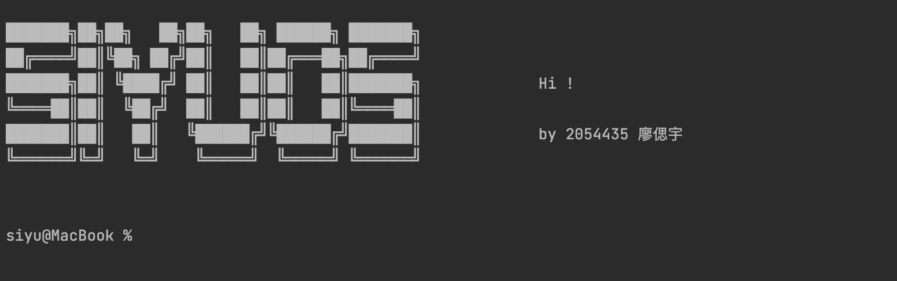

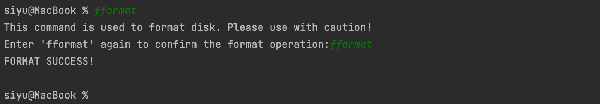

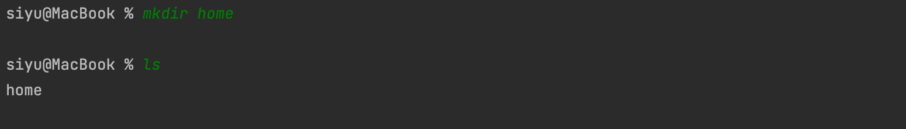

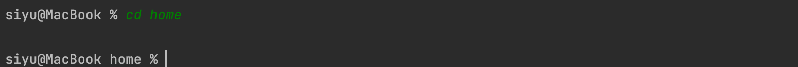

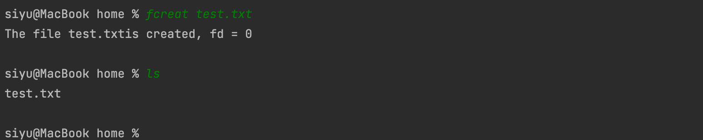

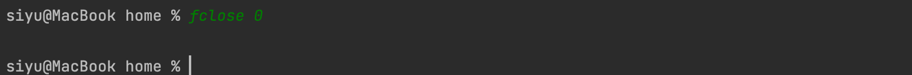

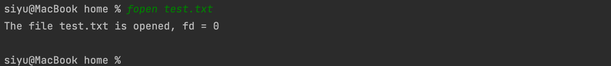

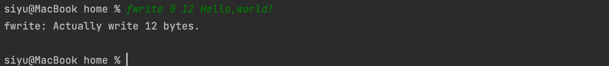

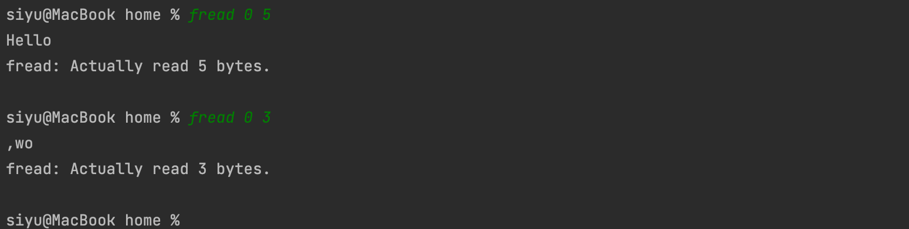

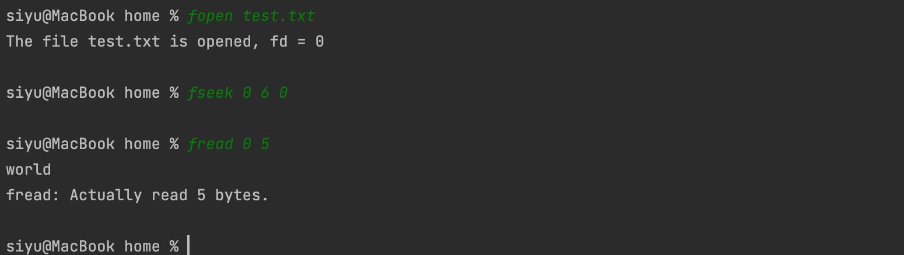

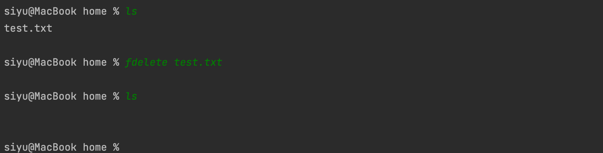

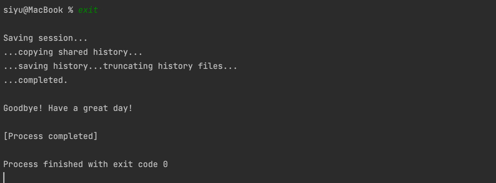

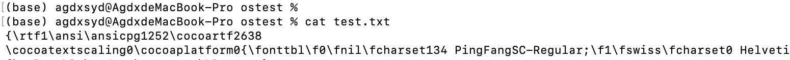

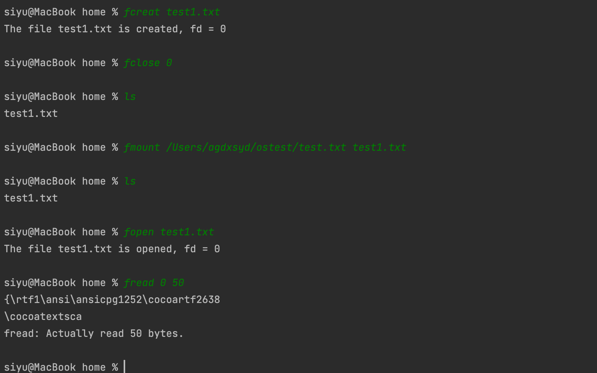
